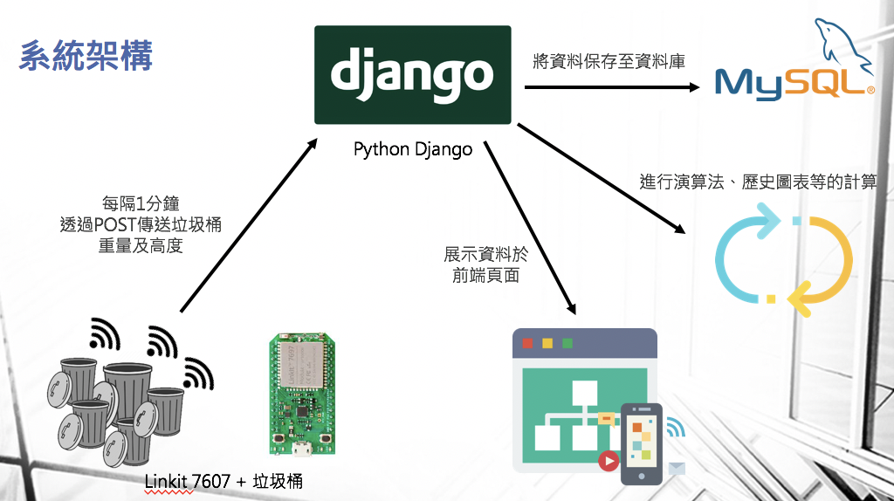

# lora-trash-project


## README目錄
* 基本介紹
  * [專案簡介](#intro)
  * [系統功能](#function)
  * [系統架構](#backend)
* 網站介紹
* 環境架設與啟動
* 成果展示

## 基本介紹

<a name="intro"></a>

### 專案簡介

垃圾桶於公共場域中為我們帶來許多便利，人們能隨手將垃圾丟至隨處可見的垃圾桶中，但當垃圾桶數量眾多並分散於各地時，經常會發生垃圾桶疏於清潔的現象，垃圾溢滿出垃圾桶，對週遭環境造成髒亂已是日常現象，這成為城市環境整潔的重要議題。

垃圾桶的髒亂不僅大幅降低遊客們對該地區文化觀感，更造成清潔人員清潔時的不便。除此之外，若要密集地查看各個地點的垃圾量又得動用大量的人力成本，在管理上極為不易。因此，如何透過最小的人力成本來有效地維持垃圾桶整潔，一直以來都是重要的議題。

所以我們希望能結合物聯網開發出能即時控管各地區垃圾桶資訊、且能為清潔人員提供一套最佳的收拾路徑的垃圾桶管理應用，進而節省人力成本及維護環境整潔。

<a name="function"></a>

### 系統功能

本團隊開發一套**智慧垃圾收運系統**，將能讓管理者節省大量人力與時間，更有效率地清潔垃圾，其核心功能如下：

(1) 垃圾桶資訊監控

通過網頁顯示目前各個垃圾桶的狀況，包含目前垃圾桶的重量、高度展示，並以顏色區分垃圾桶的重量區間，方便管理者查看有狀況的垃圾桶。

(2) 最佳清潔路線

使用者能夠在網站上選擇目前的位置，系統將根據資料庫內的垃圾桶資訊進行最佳路徑演算法，規劃出目前對於管理者最方便的收垃圾路線，清潔人員不需再一一走覽每一個地點確認垃圾量後再清潔垃圾，能有效地節省時間。

(3) 歷史圖表繪製

將於網頁上繪製垃圾桶近期的垃圾量曲線，包含每小時平均垃圾高度、重量，以利於管理者在垃圾量尖峰時段派遣足夠的清潔人力。

(4) Email即時告警系統

當某一地區的垃圾桶超過一定量時，系統將寄出信件告知管理者該地區垃圾已經過量，讓管理者能即時派人去清理垃圾。

(5) 後台管理系統

供管理者自由地新增或刪除垃圾桶，更能方便地管理整個場地中的垃圾桶分佈。

<a name="backend"></a>

#### 系統架構圖



## 網站介紹

<a name="tool"></a>

### 使用語言&工具

前端
> html, css, javascript   
>  jQuery (https://jquery.com/)   
>  Bootstrap (http://getbootstrap.com/)

後端
> Python 3.7 (https://nodejs.org/)   
> Django 2.2 (http://sailsjs.org/)   
> MySQL (https://www.mysql.com/)

物聯網端

> Linkit 7697 + Arduino
>
> 壓力感測器

## 環境架設與啟動

1. **安裝 Python3
2. **安裝 所需套件**
```
  pip install
```
3. **啟動server**
```
  cd lora_project/
  python3 manage.py runserver
```
## 成果展示

影片展示：https://youtu.be/emB-7WMfAGY